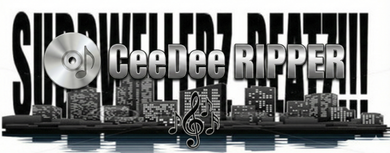
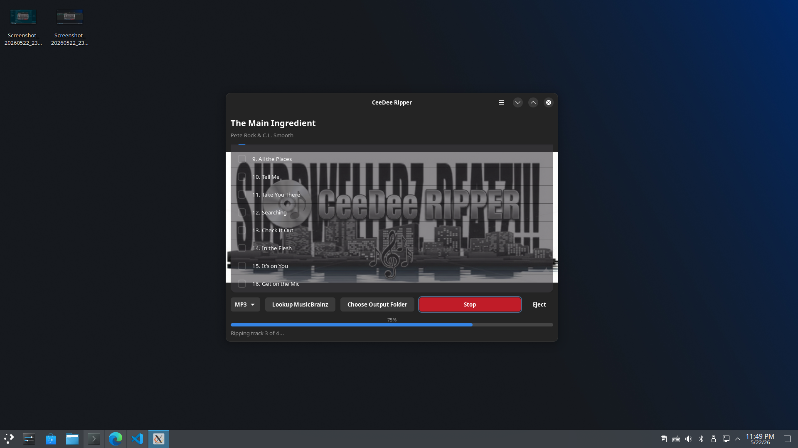
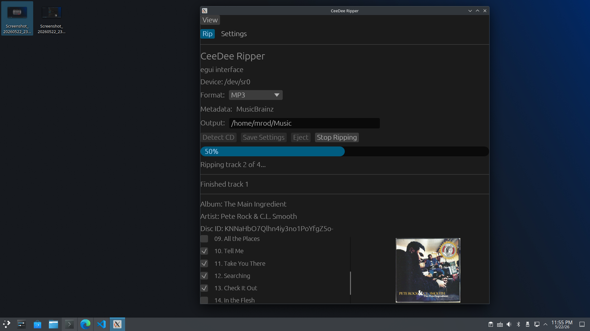

# CeeDee Ripper



CeeDee Ripper is a Linux desktop application for extracting audio CDs to common
music formats. It detects an inserted disc, looks up album metadata through
MusicBrainz, previews album art, and rips selected tracks to FLAC, MP3, WAV, or
Ogg Vorbis.

The application is written in Rust and supports two desktop front ends:

- `egui-ui`
- `gtk-ui`, using GTK4 and Libadwaita

Default builds include both front ends. The active interface can be selected at
runtime and saved for later launches.

## Screenshots





## Final mentions

CeeDee Ripper requires the Rust toolchain, native desktop libraries, optical
disc utilities, metadata libraries, and audio encoders.

On supported Linux systems, you'll need this to start modding. 
The helper script installs the aforementioned neccesary libs and Rust.

CeeDee-Ripper ver. 1.1.0 is indeed final. Mostly miscellaneous updates going forth once I upload it.

Have a look and please do fork it.

It's beautiful.

```bash
scripts/install-deps.sh
```

Important runtime tools and libraries include:

- `cdparanoia`
- `cd-discid`
- `eject`
- `flac`
- `lame`
- `vorbis-tools`
- `libdiscid`
- GStreamer base, good, and ugly plugins
- GTK4 and Libadwaita for the GTK interface

The user running the application may need permission to read the optical drive.
On many Linux systems, that means membership in the `cdrom` group, followed by a
new login session:

```bash
sudo usermod -aG cdrom "$USER"
```

## Build and Run

Build the normal release binary:

```bash
cargo build --release --features "gtk-ui egui-ui"
```

Run with the saved default interface:

```bash
cargo run --features "gtk-ui egui-ui"
```

Select an interface for a single launch:

```bash
cargo run --features "gtk-ui egui-ui" -- --ui egui
cargo run --features "gtk-ui egui-ui" -- --ui gtk
```

The selected UI is saved in the application configuration. By default, CeeDee
Ripper uses `~/.config/ceedee-ripper/config.toml`, unless a repository-local
configuration file or `CEEDEE_RIPPER_CONFIG` is used.

The CD device defaults to `/dev/sr0`. It can be changed in the configuration
file or overridden at launch:

```bash
CD_DEVICE=/dev/sr0 ceedee-ripper
```

## Packaging

Packaging files live under `packaging/`. Additional notes are kept in
`docs/PACKAGING.md` and `Distribution Instructions.md`.

The most straightforward local targets are:

- Debian/Ubuntu `.deb`
- AppImage
- Arch/AUR recipe
- Fedora/RPM recipe

Debian package metadata is also present in `Cargo.toml`.

## Notes on Flatpak and Snap

Flatpak and Snap recipes are present, but they remain more complicated than the
native packaging paths for this application.

*CONFINEMENT*

CeeDee Ripper is not merely a self-contained graphical pr
ogram. It needs low-level access to an optical drive, reads disc table-of-contents data, calls
CD helper tools, uses GStreamer encoders, contacts MusicBrainz, retrieves cover
art, and writes music files to user-visible locations. Sandboxed package formats
make each of those requirements more explicit:

- device access to `/dev/cdrom`, `/dev/sr0`, or `/dev/sr1` must be granted;
- udev, removable-media, and drive permissions may differ by distribution;
- command-line helpers and codecs must be staged inside the sandbox;
- GStreamer plugin availability must match the application's expectations;
- network access is required for metadata and cover art;
- output folders must be exposed deliberately;
- reproducible Rust and Cargo dependency vendoring is required for
  Flathub-style builds.

The Flatpak manifest currently grants broad device and filesystem permissions
for local testing and vendors Cargo sources through `generated-sources.json`.
That is useful during development. A Flathub-ready version, however, still
needs careful permission review, stable source generation, and validation on
clean systems.

The Snap recipe uses strict confinement and plugs such as `optical-drive`,
`removable-media`, `mount-observe`, `network`, `wayland`, and `x11`. That is the
right general shape. Even so, optical-drive access and desktop/media integration
may require manual connections or target-system testing before the package
behaves like a native install.

For now, Flatpak and Snap should be treated as experimental packaging paths.
Native packages and AppImage are the simpler release artifacts to validate
first.

## License

CeeDee Ripper is released under the MIT License. See `LICENSE`.
